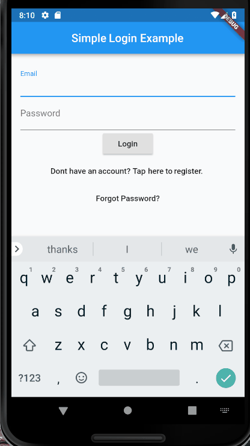

# Co-Work_mobile

## For now Flutter Simple Login Example

A new flutter application built with a simple login page with only the use of Text Fields and TextEditingControllers, and without the user of a built-in Form.

Here is an example of the application in action:

